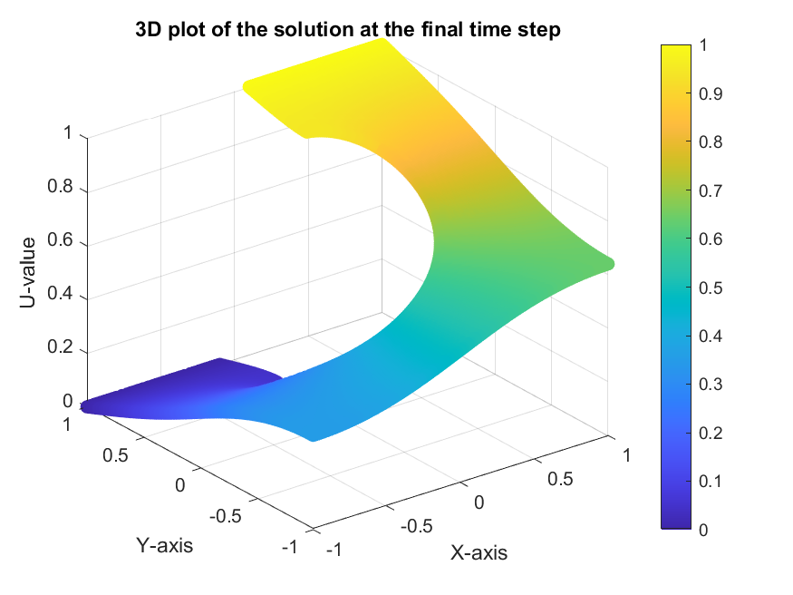
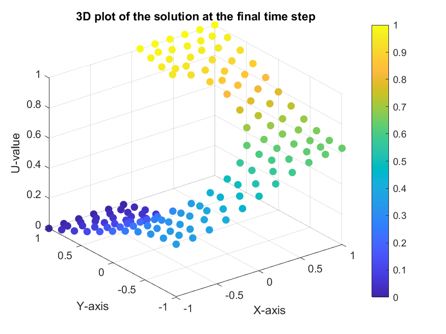
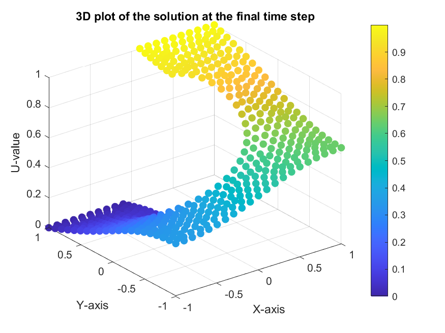
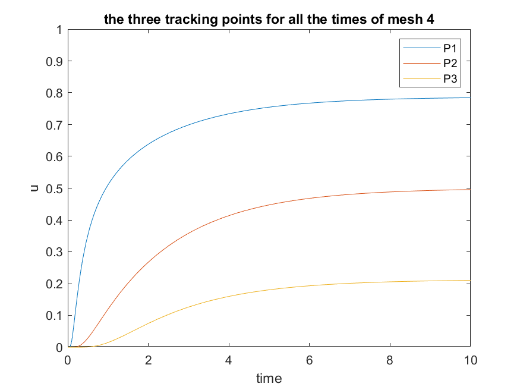
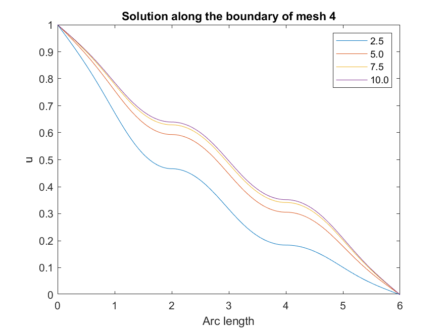
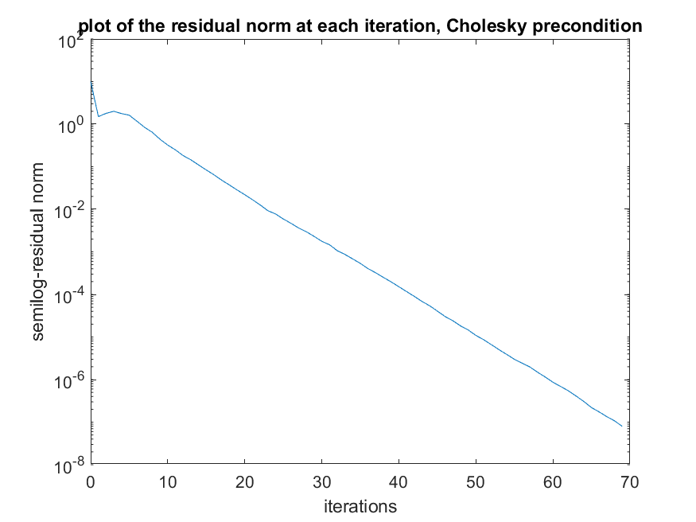
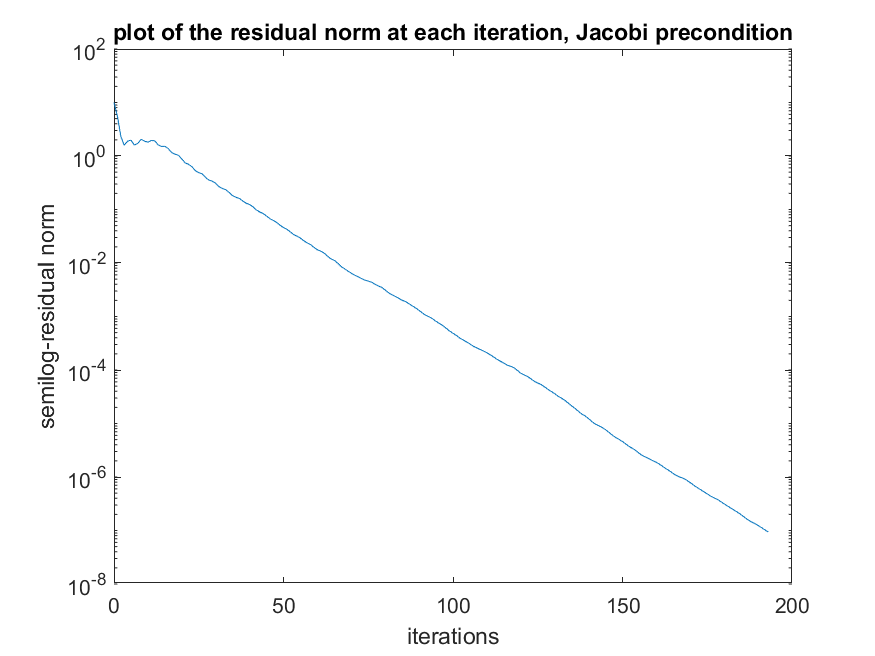

# FEM Solution for the 2D Heat Equation

*Final stationary solution of the Heat Equation computed on the finest mesh (mesh4).*

---

## 📖 Table of Contents

-   [1. Project Overview](#1-project-overview)
-   [2. Problem Formulation](#2-problem-formulation)
-   [3. Methodology](#3-methodology)
    -   [Finite Element Discretization](#finite-element-discretization)
    -   [Code Architecture](#code-architecture)
-   [4. Key Results and Analysis](#4-key-results-and-analysis)
    -   [Solution Convergence](#solution-convergence)
    -   [Boundary and Tracking Point Analysis](#boundary-and-tracking-point-analysis)
    -   [Solver Performance](#solver-performance)
-   [5. How to Run the Code](#5-how-to-run-the-code)
-   [6. Technologies Used](#6-technologies-used)

---

## 1. Project Overview

This project presents a comprehensive solution to a 2D time-dependent Heat Equation using the **Finite Element Method (FEM)** in MATLAB. The primary goal is to simulate heat diffusion over a non-trivial domain, analyzing the solution's convergence and accuracy across a series of progressively refined triangular meshes.

The implementation handles complex boundary conditions, including time-varying Dirichlet conditions, and employs the Preconditioned Conjugate Gradient (PCG) method with two different preconditioners (Incomplete Cholesky and Jacobi) to solve the resulting linear systems at each time step.

This repository includes:
-   The complete MATLAB source code, structured modularly.
-   A set of five pre-generated meshes with increasing refinement.
-   A detailed analysis of the numerical results, including error estimation and convergence rates.

---

## 2. Problem Formulation

We solve the following initial boundary value problem for the Heat Equation on a domain $\Omega \subset \mathbb{R}^2$:

$$
\begin{cases}
    \frac{\partial u}{\partial t} - \nabla^2 u = f(\mathbf{x}, t) & \text{in } \Omega \times \mathbb{T} \\
    u(\mathbf{x}, t) = d(\mathbf{x}, t) & \text{on } \Gamma_D \times \mathbb{T} \\
    \frac{\partial u}{\partial \mathbf{n}} = q(\mathbf{x}, t) & \text{on } \Gamma_N \times \mathbb{T} \\
    u(\mathbf{x}, 0) = u_0(\mathbf{x}) & \text{in } \overline{\Omega}
\end{cases}
$$

In this specific problem:
-   The system is **homogeneous** ($f=0, q=0$).
-   The initial condition is zero ($u_0=0$).
-   Dirichlet boundary conditions are applied, with one part held at zero and the other ramping linearly to a value of 1.
-   The time domain is $\mathbb{T} = [0, 10]$.

*The computational domain $\Omega$ with its boundaries ($\Gamma_{D,1}, \Gamma_{D,2}, \Gamma_N$) and points of interest ($P_1, P_2, P_3$).*

---

## 3. Methodology

### Finite Element Discretization

The problem is discretized in space using linear triangular finite elements ($P^1$ elements). The time discretization is performed using the **$\theta$-method**, which allows for a flexible transition between explicit and implicit schemes. For this project, we use $\theta = 0.5$, which corresponds to the **Crank-Nicolson method**, a second-order accurate and unconditionally stable scheme.

### Code Architecture

The code is organized into three main files for clarity and modularity:

1.  **`main_code.m`**: The main script that orchestrates the entire simulation. It iterates through the five meshes, loads the corresponding data (`.coord`, `.topol`, etc.), calls the FEM solver, and generates all the plots and tables for the analysis.

2.  **`my_fem.m`**: The core FEM solver function. It takes the mesh data and simulation parameters as input, assembles the global matrices and vectors for the time-stepping scheme, applies boundary conditions, and solves the linear system at each time step using the PCG method. It returns the final solution, iteration counts, and residual histories.

3.  **`stiff_mat.m`**: A helper function responsible for assembling the elemental stiffness matrix ($H_{loc}$) and mass matrix ($M_{loc}$) for each triangle in the mesh. These local matrices are then assembled into the global matrices $H$ and $M$ within `my_fem.m`.

---

## 4. Key Results and Analysis

### Solution Convergence

The solution was computed for five different meshes (`mesh0` to `mesh4`). As expected, the solution becomes smoother and more accurate as the mesh is refined. The final stationary solution for each mesh is shown below.

| Mesh 0                                 | Mesh 1                                 |
| -------------------------------------- | -------------------------------------- |
|  |  |
| **Mesh 2**                             | **Mesh 3**                             |
|  |  |

### Boundary and Tracking Point Analysis

The evolution of the solution was analyzed at specific locations: along the outer boundary ($\Gamma_N$) and at three interior tracking points ($P_1, P_2, P_3$). The results show a consistent behavior across the different meshes, with the solution values converging as the mesh refinement increases.

| Solution at Tracking Points (Mesh 4)           | Solution along Boundary (Mesh 4)                 |
| ---------------------------------------------- | ------------------------------------------------ |
|  |  |

### Solver Performance

We compared the performance of the PCG solver using two preconditioners: **Incomplete Cholesky** and **Jacobi**.

| Preconditioner | Iterations (Mesh4) | Error $\varepsilon$ (Mesh4) |
| :--------------- | :------------------- | :---------------------------- |
| **Cholesky**     | 69                   | 0.49026                       |
| **Jacobi**       | 193                  | 0.49026                       |

As shown in the table and the convergence plots below, the **Incomplete Cholesky preconditioner is significantly more effective**, requiring roughly one-third of the iterations compared to Jacobi to reach the same tolerance. This highlights the critical role of a good preconditioner in solving large-scale FEM problems.

| Residual Norm (Cholesky, Mesh 4)                                   | Residual Norm (Jacobi, Mesh 4)                                   |
| ------------------------------------------------------------------ | ---------------------------------------------------------------- |
|  |  |

---

## 5. Technologies Used

-   **Language:** MATLAB
-   **Numerical Methods:** Finite Element Method (FEM), Crank-Nicolson, Preconditioned Conjugate Gradient (PCG)
-   **Preconditioners:** Incomplete Cholesky Factorization, Jacobi Method
